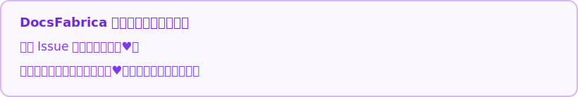

  <strong>DocsFabrica</strong>

# DocsFabrica

DocsFabrica 是一款运行在 Microsoft Word 中的 AI 文档助手，用于文档问答、修订、批注、选区处理和标准排版。

## 快速下载

Windows 安装包：[DocsFabrica-Windows-Setup-v0.5.37.exe](downloads/windows/DocsFabrica-Windows-Setup-v0.5.37.exe)

macOS 版本暂未开放，后续版本将提供支持。

## 文档入口

- [用户手册 / User Guide](docs/用户手册.md)
- [测试版说明 / Beta Notice](docs/BETA.md)
- [更新日志 / CHANGELOG](docs/CHANGELOG.md)
- [软件许可协议 / LICENSE](LICENSE)
- [隐私说明 / Privacy Policy](docs/PRIVACY.md)
- [免责声明 / Disclaimer](docs/DISCLAIMER.md)

## 核心功能

- 问答模式：基于当前 Word 文档生成回答，不直接修改文档。
- 修订模式：将 AI 修改建议写入 Word，并配合 Word 的修订功能检查和接受修改。
- 批注模式：在文档中添加审阅批注，适合指出问题、风险和需要补充的位置。
- 使用选区：只处理用户在 Word 中选中的部分内容。
- 标准排版：统一标题层级、正文格式和编号。
- 自动备份：插件启动后会在原文档所在目录创建备份文件。

## 当前支持情况

- 当前已完成适配与测试的模型服务商为 `DeepSeek`。
- 其他模型服务商入口为后续兼容性预留，当前暂不建议使用。
- 关联参考文件功能仍不稳定，暂不推荐使用。
- 使用个人 API Key 时，模型服务费用和 Token 消耗由用户自行承担。

## 问题反馈

非常欢迎用户反馈意见。如果遇到问题，或希望提出功能建议，可以通过 GitHub Issues 留言，也可以发送邮件反馈：

[提交问题或建议](https://github.com/ShangyuanYU/DocsFabrica/issues)

反馈邮箱：<yushangyuan1997@gmail.com>

反馈问题时，建议提供 DocsFabrica 版本号、Windows 和 Microsoft Word 版本、问题出现前的操作步骤，以及错误提示或截图。

请不要在 Issue 中提交 API Key、完整 Token、隐私文档或其他敏感信息。
