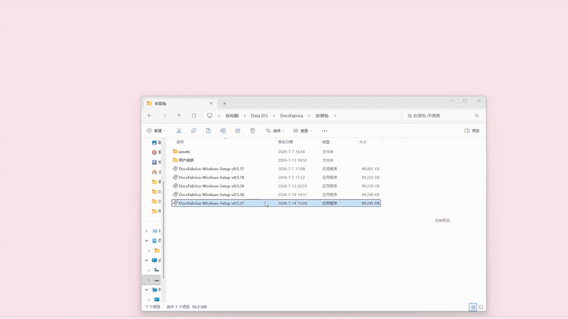
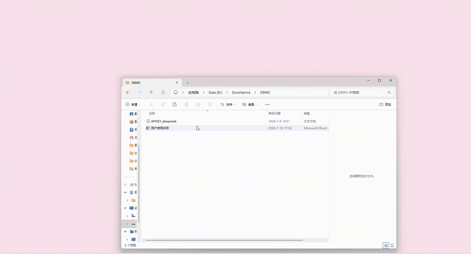
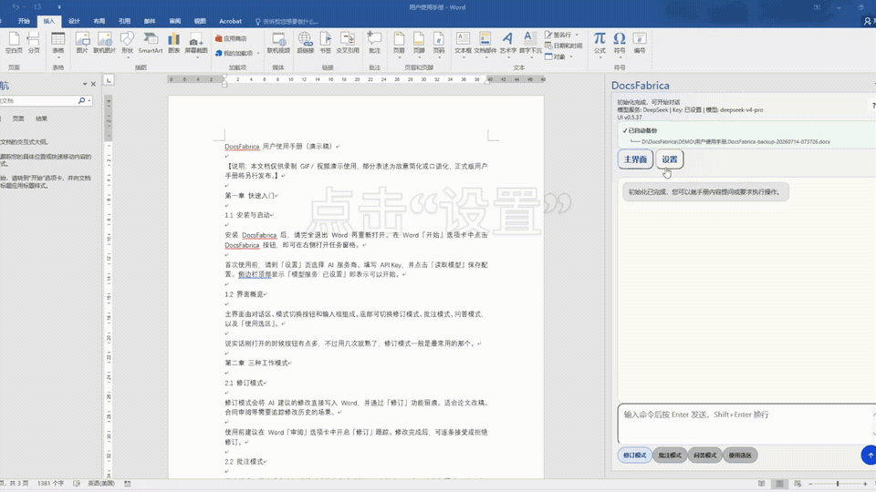
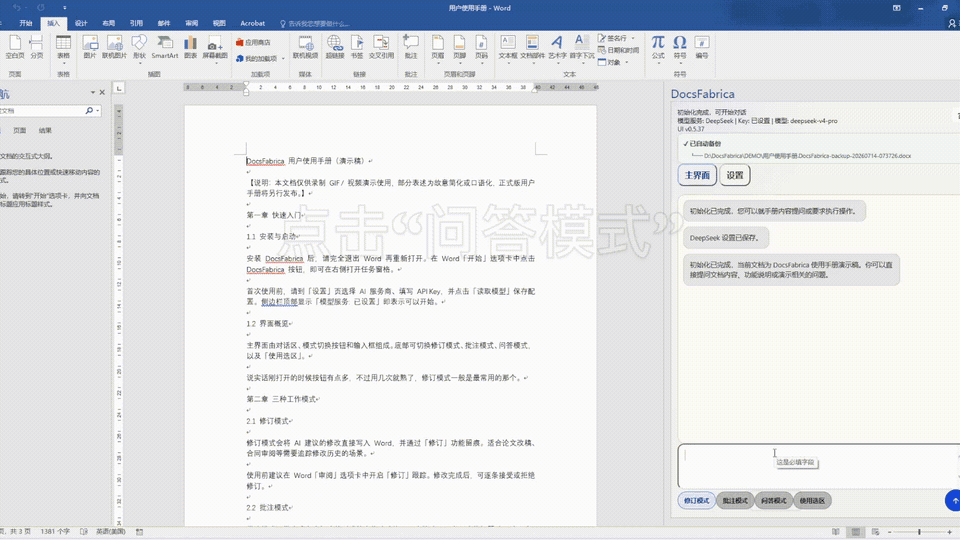
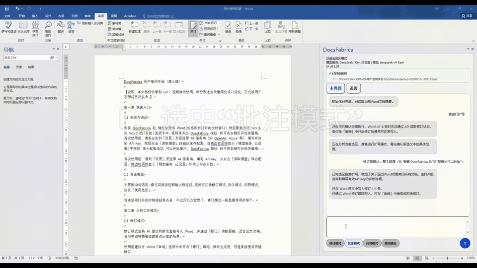

# DocsFabrica用户手册

DocsFabrica 是一款运行在 Microsoft Word 中的 AI 文档助手。它可以读取当前文档和用户选择的参考文件，完成文档问答、内容扩写、修订、批注和标准排版。

> 当前版本处于 Beta 测试阶段。处理重要文档前，请保留原文件，并在 Word 中逐项检查 AI 生成的内容。

使用本软件前，请阅读[《软件许可协议》](../LICENSE)、[《隐私说明》](PRIVACY.md)、[《免责声明》](DISCLAIMER.md)和[《Beta（测试版）说明》](BETA.md)。

## 目录

- [快速开始](#快速开始)
- [1. 安装 DocsFabrica](#1-安装-docsfabrica)
- [2. 在 Word 中打开](#2-在-word-中打开)
- [3. 配置模型与 API Key](#3-配置模型与-api-key)
- [4. 问答模式](#4-问答模式)
- [5. 修订模式](#5-修订模式)
- [6. 批注模式](#6-批注模式)
- [7. 使用选区](#7-使用选区)
- [8. 关联参考文件（不稳定）](#8-关联参考文件不稳定)
- [9. 标准排版](#9-标准排版)
- [10. 卸载](#10-卸载)
- [11. 常见问题](#11-常见问题)
- [12. 数据与隐私](#12-数据与隐私)
- [问题反馈](#问题反馈)

## 快速开始

1. 安装 DocsFabrica，并重新启动 Word。
2. 打开一个已保存的 `.docx` 文档。
3. 在 Word 的 `开始` 选项卡点击 `DocsFabrica` 按钮。
4. 在任务窗格的 `设置` 页面配置模型服务商和 API Key。
5. 返回主界面，选择 `修订模式`、`批注模式` 或 `问答模式`。
6. 输入命令，按 `Enter` 发送。

输入框快捷键：

- `Enter`：发送命令。
- `Shift + Enter`：换行。

[返回目录](#目录)

## 1. 安装 DocsFabrica

### 系统要求

- Windows 10 或 Windows 11（64 位）。
- Microsoft Word 2016 或更高版本。
- 可访问所选 AI 模型服务商 API 的网络环境。
- 对应服务商提供的 API Key。

### macOS

macOS 版本暂未开放，后续版本将提供支持。

### Windows

下载地址：[DocsFabrica-Windows-Setup-v0.5.37.exe](../downloads/windows/DocsFabrica-Windows-Setup-v0.5.37.exe)

1. 完全退出 Microsoft Word。可在任务栏右键 Word 并选择退出，确保 Word 进程已结束。
2. 下载并双击运行 `DocsFabrica-Windows-Setup-v0.5.37.exe`。
3. 在安装向导中勾选以下确认项：
   - `我已阅读并同意《软件许可协议》`
   - `我已阅读并悉知《隐私说明》`
   - `我已阅读并悉知《免责声明及Beta测试说明》`
4. 按安装向导点击 `下一步 -> 安装`，等待安装完成。
5. 安装完成后，再次完全退出 Word 并重新打开。
6. 在 Word 的 `开始` 选项卡点击 `DocsFabrica` 按钮。
7. 若侧边栏空白，先双击桌面 `DocsFabrica-start.cmd`，再重新打开 DocsFabrica 面板。
8. 首次使用时，在侧边栏 `设置` 中配置 API Key 并保存。

安装程序会自动完成以下操作：

- 将程序安装到 `%LOCALAPPDATA%\DocsFabrica`。
- 注册 Word 加载项。
- 配置本地 HTTPS 服务：`https://localhost:3000`。
- 设置登录自启动。
- 在桌面创建 `DocsFabrica-start.cmd` 快捷启动脚本。

升级安装时，如已安装旧版，直接运行新版安装包覆盖安装即可。安装前同样需要完全退出 Word。

安装验证：打开 Word，进入 DocsFabrica 侧边栏，在 `设置` 页面底部应显示 `UI v0.5.37`。



[返回目录](#目录)

## 2. 在 Word 中打开

1. 打开 Word，并打开一个已经保存到本地磁盘的 `.docx` 文档。
2. 在 Word 的 `开始` 选项卡点击 `DocsFabrica` 按钮。
3. DocsFabrica 会显示在 Word 右侧任务窗格中。
4. 如果侧边栏空白，先双击桌面 `DocsFabrica-start.cmd`，完全退出 Word 后重新打开。



插件启动后会读取当前文档，并在原文档所在目录创建备份。备份文件名类似：

```text
原文件名.DocsFabrica-backup-YYYYMMDD-HHMMSS.docx
```

[返回目录](#目录)

## 3. 配置模型与 API Key

首次使用时需要配置模型服务：

1. 打开任务窗格中的 `设置`。
2. 选择模型服务商。
3. 输入该服务商的 `API Key`。
4. 点击 `读取模型`。
5. 从列表中选择模型。
6. 点击 `保存设置`。



### 模型服务说明

当前版本已完成对 DeepSeek 模型服务的适配与测试，其他模型服务商接口暂作为扩展入口预留，相关功能尚未完成充分测试，暂不建议使用。

使用本软件调用 AI 服务时，将消耗对应模型服务商提供的 Token 配额。<strong style="color: red;">Token 消耗量与文档长度、任务复杂度、调用次数等因素有关。</strong>

本软件仅负责向模型服务商发送用户指定的处理请求，不直接控制模型服务商的计费规则和 Token 消耗情况。建议用户首次使用时，先选择较短的 Word 文档进行测试，确认处理效果及 Token 消耗情况后，再处理较长或复杂文档。

<strong style="color: red;">如使用用户个人 API Key，相关模型服务费用将由用户根据对应服务商规则自行承担。</strong>

[返回目录](#目录)

## 4. 问答模式

问答模式只生成回答，不会修改当前 Word 文档或关联文件。

1. 在主界面选择 `问答模式`。
2. 输入问题。
3. 按 `Enter` 发送。



示例命令：

```text
总结当前文档的核心内容
```

```text
列出本文档的主要结论
```

[返回目录](#目录)

## 5. 修订模式

修订模式会把 AI 建议写入 Word 正文，并尽量以 Word“修订”的形式保留修改痕迹。

1. 在主界面选择 `修订模式`。
2. 在 Word 中开启 `修订`，选项卡中选择 `审阅 -> 修订`。
3. 发送命令，等待 DocsFabrica 写入修改。
4. 在 Word 的 `审阅` 页面检查、接受或拒绝修订。


示例命令：

```text
把第四节的表达改得更正式，保留原意
```

```text
精简研究背景，删除重复表述
```

```text
扩写研究意义部分，补充实际应用价值
```

修订完成后，DocsFabrica 可能继续检查全文中的语义冲突和格式问题。如果任务窗格显示确认选项，请根据文档实际情况选择后再继续。

[返回目录](#目录)

## 6. 批注模式

批注模式不会直接改写正文，而是在对应位置添加 Word 批注，适合审阅和风险提示。

1. 在主界面选择 `批注模式`。
2. 输入检查要求。
3. 发送命令。
4. 在 Word 的批注区域检查结果。



示例命令：

```text
检查全文中绝对化或不严谨的表达，并用批注指出
```

```text
标出需要补充数据来源或参考文献的位置
```

```text
检查论证是否充分，把问题写入批注
```

批注功能要求当前 Word 版本支持 `WordApi 1.4`。

[返回目录](#目录)

## 7. 使用选区

只处理文档中的一部分内容时：

1. 在 Word 中选中目标文本。
2. 在 DocsFabrica 中启用 `使用选区`。
3. 选择修订、批注或问答模式。
4. 输入针对选中内容的命令。


示例：

```text
把选中内容改写得更简洁
```

```text
解释选中段落中的专业术语
```

未选中文本时，请先回到 Word 完成选择，再启用选区。

[返回目录](#目录)

## 8. 关联参考文件（不稳定）

DocsFabrica 可以把本地资料作为回答和修改的参考上下文。

该功能当前仍不稳定，暂不推荐使用。后续版本将继续改进关联文件读取、引用和同步能力。

1. 打开 `设置`。
2. 展开 `关联文件`。
3. 点击 `选择文件`。
4. 选择一个或多个文件。
5. 勾选本次任务需要使用的文件。

关联文件提供两种模式：

- `读取文件`：只读取文件，不修改文件。建议默认使用。
- `同步模式`：在用户明确要求时，尝试同步修改勾选的文本类文件。

同步修改仅适用于 `.txt`、`.md`、`.csv`、`.json`、`.xml`、`.html` 等文本文件。PDF、Word、Excel 和 PowerPoint 文件仅作为参考读取。

示例命令：

```text
结合关联文件，总结当前方案还缺少哪些内容
```

```text
根据关联资料补充当前文档的技术路线
```

[返回目录](#目录)

## 9. 标准排版

标准排版用于统一全文的标题层级、正文格式和编号。该功能可能修改全文格式，因此会先扫描文档并要求用户确认。

1. 输入标准排版命令。
2. 确认进入标准排版流程。
3. 等待格式扫描完成。
4. 根据提示确认标题级别和编号设置。
5. 检查待修改项后执行修正。


示例命令：

```text
对全文进行标准排版
```

```text
统一文档的标题、正文和编号格式
```

标准排版时会忽略当前的修订、批注、问答模式和选区设置，并按全文排版流程处理。

[返回目录](#目录)

## 10. 卸载

### macOS

macOS 版本暂未开放。

### Windows

卸载前请完全退出 Microsoft Word。

推荐方式任选其一：

方式 A：通过 Windows 设置卸载。

1. 打开 Windows `设置 -> 应用 -> 已安装的应用`。
2. 找到 `DocsFabrica`。
3. 点击 `卸载`，按提示完成卸载。

方式 B：运行卸载脚本。

1. 在资源管理器地址栏输入并回车：

```text
%LOCALAPPDATA%\DocsFabrica
```

2. 右键 `uninstall-windows.ps1`，选择使用 PowerShell 运行。

也可以在 PowerShell 中执行：

```powershell
powershell -NoProfile -ExecutionPolicy Bypass -File "$env:LOCALAPPDATA\DocsFabrica\uninstall-windows.ps1"
```

卸载会移除：

- `%LOCALAPPDATA%\DocsFabrica` 下的程序文件。
- Word 加载项注册信息。
- 计划任务或开机自启动项。

如果卸载后 Word 中仍有 DocsFabrica 图标：

1. 确认 Word 已完全退出。
2. 再次运行上述卸载脚本。
3. 仍有问题时，可执行深度清理：

```powershell
powershell -NoProfile -ExecutionPolicy Bypass -File "$env:LOCALAPPDATA\DocsFabrica\bin\purge-word-addin.ps1"
```

如果目录已删除但仍需清理脚本，请从旧版备份中获取，或联系提供方。

[返回目录](#目录)

## 11. 常见问题

### Word 中找不到 DocsFabrica

- 确认安装程序已经执行成功。
- 完全退出 Word 后重新打开。
- 在 Word `开始` 选项卡中查找 `DocsFabrica` 按钮。
- 如仍没有按钮，可重新运行安装包覆盖安装。
- 检查本地服务是否可以访问：`https://localhost:3000`。

### 侧边栏空白或显示“等待 Word 就绪”

1. 双击桌面 `DocsFabrica-start.cmd`。
2. 完全退出 Word 后重新打开。
3. 在 Word `开始` 选项卡重新打开 DocsFabrica 面板。

### 提示“模型服务未设置”

进入 `设置`，重新选择服务商，填写 API Key，点击 `读取模型`，选择模型后保存。

### 无法读取关联文件

- 确认已经在文件列表中勾选目标文件。
- 检查文件是否过大。
- 某些复杂 PDF、PPT 或 Excel 文件可能只能读取有限内容。

### 修订没有写入 Word

- 确认命令包含明确的修改目标和要求。
- 在 Word 的 `审阅` 中手动打开“修订”后重试。
- 检查原文是否已在命令执行期间被修改，导致目标文本无法匹配。
- 尝试先选中文本，再使用选区修订。

### 批注无法写入

请更新 Microsoft Word。批注写入需要 Word 支持 `WordApi 1.4`。

### 模型请求失败

- 检查网络连接。
- 检查 API Key 是否有效、是否有可用额度。
- 确认所选模型对当前账号可用。
- 重新读取模型并保存设置。

[返回目录](#目录)

## 12. 数据与隐私

- DocsFabrica 会在本地读取当前 Word 文档和用户主动选择的关联文件。
- 发送命令时，相关文档内容、关联文件内容和用户命令可能被发送给用户选择的模型服务商。
- DocsFabrica 不会主动读取用户未选择的任意文件。
- 用户应遵守所在组织的数据安全要求，不要使用未经批准的模型服务处理敏感、保密或受监管文档。
- 插件可能执行更新检查、本地备份、异常日志记录和匿名启动统计；具体行为以当前发布版本为准。

[返回目录](#目录)

## 使用建议

对于重要文档，建议按照以下顺序操作：

1. 先用问答模式总结并核对内容。
2. 再用批注模式标出问题。
3. 使用修订模式生成修改。
4. 最后执行标准排版。
5. 在 Word 中人工复核所有结果。

[返回目录](#目录)

## 问题反馈

非常欢迎用户反馈意见。如果在使用过程中遇到问题，或希望提出功能建议，可以通过 GitHub Issues 留言，也可以发送邮件反馈：

[提交问题或建议](https://github.com/ShangyuanYU/DocsFabrica/issues)

反馈邮箱：<yushangyuan1997@gmail.com>

反馈问题时，建议附上以下信息：

- DocsFabrica 版本号。
- Windows 和 Microsoft Word 版本。
- 问题出现前的操作步骤。
- 错误提示、截图或可复现的示例文档说明。

请不要在 Issue 中提交 API Key、完整 Token、隐私文档或其他敏感信息。
